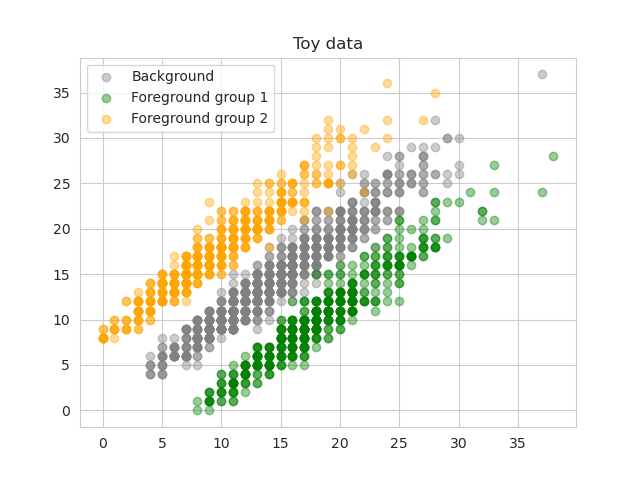
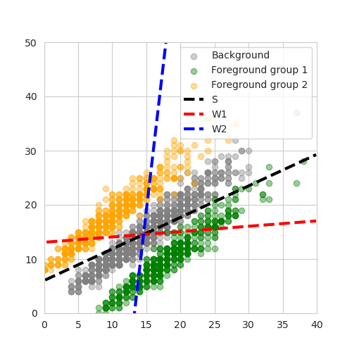

# Pytorch reimplementation of Contrastive Poisson latent variable models

This project is my effort to learn to implement Bayesian probabilistic latent variable modelling and inference framework in Pytorch. I tried to implement the Contrastive Poisson latent variable model as described in the paper [Contrastive latent variable modeling with application to case-control sequencing experiments](https://arxiv.org/abs/2102.06731) by [Jones et al.](https://github.com/andrewcharlesjones/cplvm/tree/main?tab=readme-ov-file). The provided code for model inference by the authors are in ```tensorflow```. 

In this paper, the authors propose a novel probabilistic model for case-control discreet data. Direct applications involve when we have single-cell RNA-seq data from two samples, case and control, such that each data matrix is of size $(n,m)$ where $n$ is the number of cells, and $m$ is the number of genes ($n$ can be different among samples but $m$ should be similar). The CPLVM model is designed to capture the contrastive latent patterns between case-control: There are latent patterns of gene expression variations that are shared across samples (such as variations driven by cell types), and latent patterns that are foreground-specific (in this case, variations in gene expression that is only observed in case sample). Model details: 

- **Observed data**: 
  - $X \in \mathbb{N}^{n_x \times m}$, where $X_{ij}$ is the count of gene $j$ in cell $i$.
  - $Y \in \mathbb{N}^{n_y \times m}$, where $Y_{ij}$ is the count of gene $j$ in cell $i$.
  - $n_x, n_y$ are the number of cells in case and control samples, respectively.
  - $m$ is the number of genes.
  - Let $X$ represents data from case sample and $Y$ represents data from control sample.
- **Generative model**:

$$
Y_{i1} \sim \text{Poisson}(\alpha_{i1}\mathbf{\sigma} \circ (\mathbf{S}^T \mathbf{z}_{i1})) \\
$$

$$
X_{i2} \sim \text{Poisson}(\alpha_{i2}(\mathbf{S}^T \mathbf{z}_{i1}+ \mathbf{W}^T \mathbf{t} )) \\  
$$

[//]: # ($$)

X_{i2} \sim \text{Poisson}(\alpha_{i2}(\mathbf{S}^T \mathbf{z}_{i2} + \mathbf{W}^T \mathbf{t}_{i2}))

[//]: # ($$)


where: 
  - $i1$: index of cells (rows) in case sample $X$
  - $i2$: index of cells (rows) in control sample $Y$
  - $\mathbf{z}_{i1,l} \sim \text{Gamma}(\gamma_1, \beta_1) $: *shared, one entry $i1,l$* latent variable for case sample
  - $\mathbf{z}_{i2,l} \sim \text{Gamma}(\gamma_2, \beta_2) $: *shared, one entry $i2,l$* latent variable for control sample
  - \( \mathbf{t}_{i2,d} \sim \text{Gamma}(\gamma_3, \beta_3) \): *foreground-specific, one entry \({i2,d}\)* latent variable for control sample \(X\). 
  - \( \mathbf{S} \in \mathbb{R}^{L \times m} \): loading matrix (weights) shared across the background (\(Y, z_{i1}\)) and foreground (\(X, z_{i2}\)) samples. 
  - \( \mathbf{W} \in \mathbb{R}^{D \times m} \): loading matrix (weights) specific to the foreground sample \(X\).
  - The model learns the optimal values of \(\mathbf{S}\), \(\mathbf{W}\), \(z_{i1}\), \(z_{i2}\), \(t_{i1}\) that best fit the data \(X\) and \(Y\), with prior distributions. Inference framework is based on variational inference, with the objective to maximize the ELBO, and log-normal variational distributions for latent variables. Please kindly refer to the paper for details about the models, since there is no way to shortly explain it in this README.


## Examples

I copied the example data provided in the orginal [CPLVM repository](https://github.com/andrewcharlesjones/cplvm/tree/main), stored in the folder ```data```. Here, $X$ and $Y$ are both matrices with 2 columns, i.e. data points are 2D vectors. Foreground data is generated to be from two distinct groups. The data is plotted out as below:


To run CPLVM for this particular data:
```python
# Now define the model
import torch
from torch import nn
from torch.nn import functional as F
import cplvm
import numpy as np
import pandas as pd

Y = pd.read_csv("./data/toy_background.csv", header=None).values
X = pd.read_csv("./data/toy_foreground.csv", header=None).values

# now apply the model to the sample data
Kf=2  # number of foreground-specific latent variables
Ks=1  # number of shared latent variables
model = cplvm.CPLVM(p, Ks, Kf)
model._fit_VI(torch.tensor(X), torch.tensor(Y), 10000, 0.01)
```
The resulting inferred latent factor weights are plotted below:


You can see the whole example code at ```cplvm_learning.ipynb```.

## Installation
As of right now, since the model is specified in one file ```cplvm.py```, you can simply copy the file to your project directory and import it. You will need ```torch``` to run the model, and ```numpy```, ```pandas``` to read in the data as in ```cplvm_learning.ipynb```. I will try to make it a package in the future if there are demands. I also implemented only the model that is generated by Poisson distribution for discrete data (such as counts from single-cell RNA-seq data), the paper did present more background on contrastive probabilistc methods that were previously developed such as contrastive PCA and its probabilistic version. The orginal repository also contains the implementation of these models in tensorflow. If you like those implemented in Pytorch please reach out to me at ```ha.vu@gladstone.ucsf.edu```. Right now I do not implement them since I stopped working on it once I learned the fundamental ideas of the paper. 